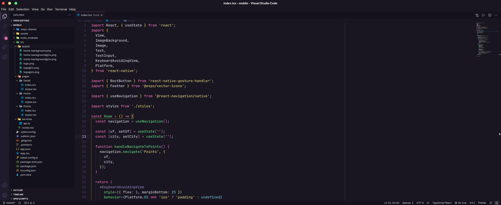
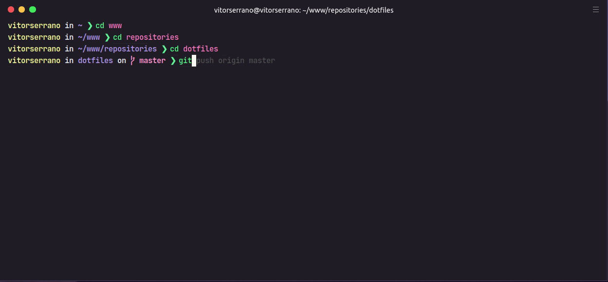

    

 

<h3 align="center">
   📝 Dotfiles
</h3>

Estas são as configurações que estou usando atualmente no meu <b>editor de código</b>, <b>terminal</b> e <b>sistema operacional</b> para desenvolvimento de aplicações.

## Índice

- [Visual Studio Code](#visual-studio-code)
- [Terminal](#terminal)
- [Ubuntu](#ubuntu)

## ⚡ Visual Studio Code

  

- Tema: [Omni](https://marketplace.visualstudio.com/items?itemName=rocketseat.theme-omni)
- Pacote de ícones: [Material Icon Theme](https://marketplace.visualstudio.com/items?itemName=PKief.material-icon-theme)
- Font: [JetBrains Mono](https://www.jetbrains.com/pt-pt/lp/mono/)
- [Extensões]()
- [Configurações (settings.json)](vscode-settings.json)

## 🚀 Terminal

  

- [Hyper](https://hyper.is/)
- Tema: [Omni](https://github.com/getomni/hyper-omni)
- Font: [JetBrains Mono](https://www.jetbrains.com/pt-pt/lp/mono/)
- Configurações:
    - [hyper,js](.hyper.js)
    - [zshrc](.zshrc)
    
    
