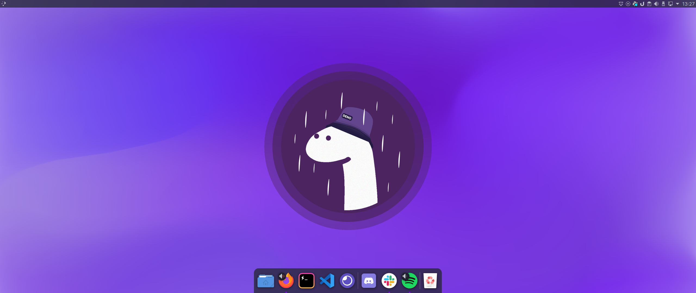

    

 

<h3 align="center">
   📝 Dotfiles
</h3>

Estas são as configurações que estou usando atualmente no meu <b>editor de código</b>, <b>terminal</b> e <b>sistema operacional</b> para desenvolvimento de aplicações.

## Índice

- [Visual Studio Code](#visual-studio-code)
- [Terminal](#terminal)
- [Ubuntu](#ubuntu)

 
 

## ⚡ Visual Studio Code

  

- Tema: [Aura theme](https://marketplace.visualstudio.com/items?itemName=DaltonMenezes.aura-theme)
- Pacote de ícones: [Material Icon Theme](https://marketplace.visualstudio.com/items?itemName=PKief.material-icon-theme)
- Font: [JetBrains Mono](https://www.jetbrains.com/pt-pt/lp/mono/)
- Extensões:

  - [Script para instalar todas](install-extensions.sh)

  1. Aura Theme
  2. Code Runner
  3. Colorize
  4. ESLint
  5. Material Icon Theme
  6. Path intellisense
  7. Prettier - Code formatter
  8. Snapcode
  9. vscode-styled-components
  10. Rocketseat React Native
  11. Rocketseat ReactJS

- [Configurações (settings.json)](vscode-settings.json)

 
 

## 🚀 Terminal

  

- [Hyper](https://hyper.is/)
- Tema: [Aura theme](https://github.com/daltonmenezes/aura-theme/tree/master/packages/hyper-terminal)
- Font: [JetBrains Mono](https://www.jetbrains.com/pt-pt/lp/mono/)
- Configurações:
  - [hyper,js](.hyper.js)
  - [zshrc](.zshrc)

 
 

## 🖥 Ubuntu

  

    
- Versão: KUbuntu 20.04 LTS
- Tema: Dracula
- Ícones: Tela purple
- Cursor: WhiteSur-Cursors
- Dock: Latte
- Fonts: [Inter](https://fonts.google.com/specimen/Inter)
